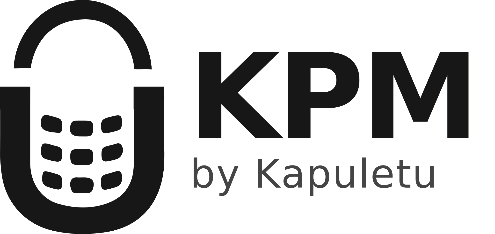

  

 

# KPM (Kapuletu Project Manager)

KPM is a comprehensive, enterprise-grade project management system designed to streamline the software development lifecycle. Built with a focus on strict governance, real-time collaboration, and architectural clarity, KPM provides organizations with the tools necessary to manage complex portfolios, enforce engineering standards, and track deliverables with precision.

## Core Capabilities

### Organization Governance & Standards
Maintain consistency across all operations through centralized organization management. Define and enforce global engineering standards, coding conventions, and definitions of done (DoD) that automatically cascade to all projects within the workspace.

### Strict Role-Based Access Control (RBAC)
Security and focus are maintained through a meticulously designed access control matrix:
- **Organization Admins:** Full visibility and destructive authority across the entire workspace, including global standards and organization-wide analytics.
- **Project Managers:** Autonomous control over assigned projects, including team assembly, sprint planning, and backlog prioritization.
- **Team Members:** Streamlined, focused workspaces showing only relevant tasks, deliverables, and upcoming standups.

### Lifecycle & Portfolio Management
Track initiatives from conception to deployment. Projects support distinct lifecycle states (Planning, Active, On Hold, Archived) allowing organizations to maintain clean, relevant dashboards while preserving historical data. 

### Granular Execution Tracking
Work is logically structured to mirror enterprise development workflows:
- **Modules & Features:** Break down high-level business requirements into manageable technical features.
- **Sprints & Backlogs:** Organize work into time-boxed iterations. 
- **Deliverables:** Track individual assignments with strict peer review processes and approval gates.
- **Standups & Meetings:** Capture daily blockers and formal meeting action items directly within the project context.

## Design Philosophy

The system was engineered with a strict adherence to a clean, professional user experience. Interface elements are purposefully designed to reduce cognitive load, surfacing critical metrics and required actions without overwhelming the user. 

- **Dynamic Workspaces:** Dashboards adapt to the authenticated user's role, ensuring that Project Managers see portfolio health while developers see immediate technical assignments.
- **Auditability:** Every significant action, status change, and approval is tracked to ensure full accountability across the development lifecycle.
- **Performance:** Optimized data fetching and strict state management ensure a highly responsive experience, regardless of the workspace size or complexity.
